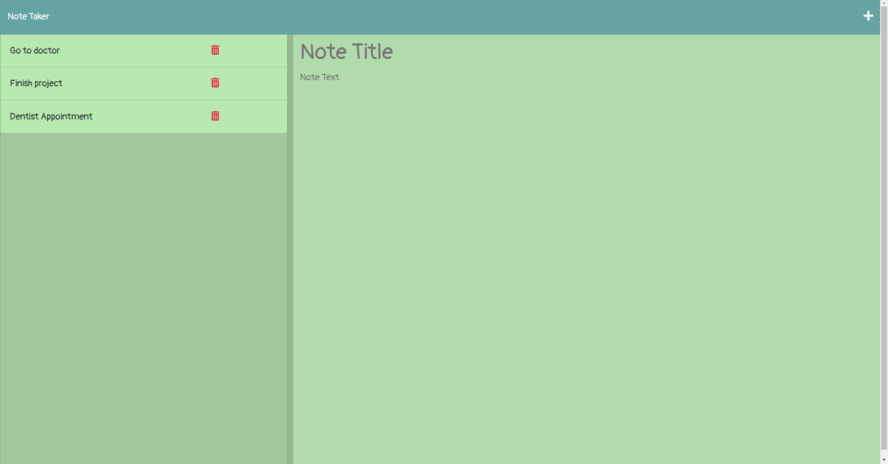
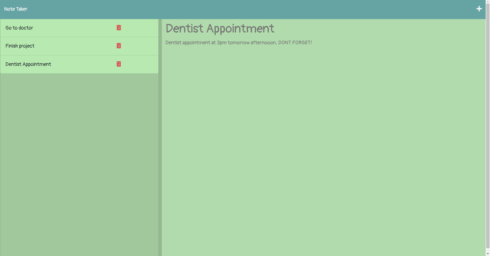
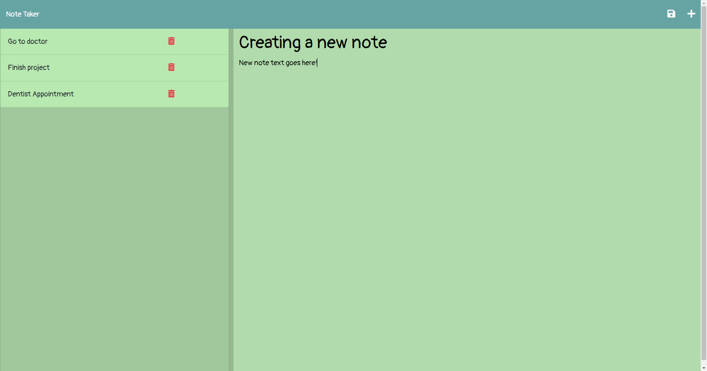

# Note Taker Express.js

This is a back-end Note Taker project that connects to the front end using Express.js.

## Usage

To use the Note Taker do the following:

- Click the Get Started button in the middle of the page.
- Where you see "Note Title" and under it there is "Note Text", that is where you input your note contents.
- Once you are satisified with your note, locate the save icon on the upper right hand side of the page.
- You will see your note pop up on the left side column, click on it to see the note text.
- If you want to create a new note, press the "+" icon on the upper right hand side of the page.
- Once you are done with your note, click the red trash can icon next to the note and your note will be deleted.

## Screenshots

## Deployed Link

[Here]() is the link to the note taker application.

## Technologies used

- JavaScript
- Express.js

- Node.js
    - Nodemon package
    - fs package
    - uuid package

# Credits

This project was created and edited by Jacob Lowther